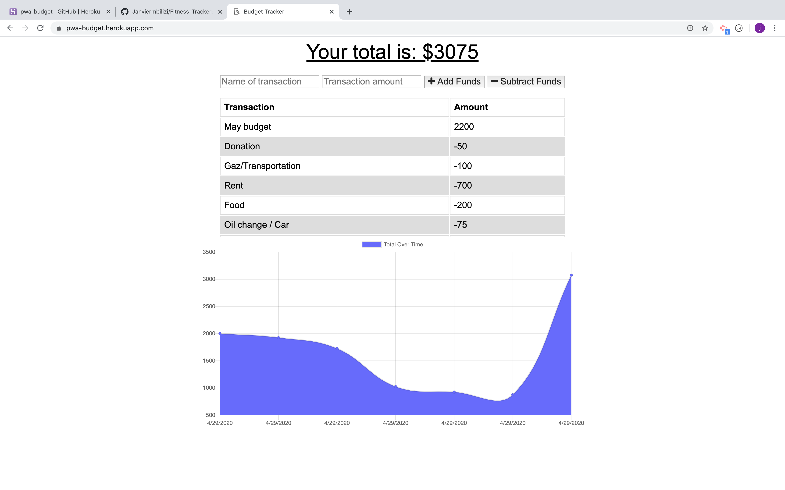

# Progressive-Budget

<strong>Name</strong>

This project takes the name of (Progressive-budget) as it is a budget app with the ability to operate offline.

<strong>Description </strong>

As a web developer, I want a deployed portfolio so that I can showcase my applications to potential employers and clients. It is in that spirit that my instructor gave me and other students a homework to design a progressive web application. With this App the user will be able to add expenses and deposits to their budget with or without a connection. When entering transactions offline, they should populate the total when brought back online.You can intall and use it as an app by clicking the + icon on the right corner of the url.

<strong>Programs used</strong>

I used HTML, CSS (in Video Studio Code) and Bootstrap, javascript, jquery, node, express, mongodb, PWA (manifest, service worker), Git/Github and heroku for deployment.

<strong>Installation </strong>

This is only website and does not need installation. it is currently hosted in heroku and you can access it at https://pwa-budget.herokuapp.com/. You can intall it as an app by clicking the + icon on the right corner of the url.

<strong>Usage</strong>

The page is simple, clean, easy to use and undertand. Once you are on the page, you just enter your transaction name and amount then it will populate the table and the chart. Again You can intall and use it as an app by clicking the + icon on the right corner of the url.

<strong>Support and Contribution</strong>

If you have any question or want to see my Repo, please email me at janviermbilizi@gmail.com.

<strong>Authors and acknowledgement</strong>

As a unique Author of this project, I want to give a big thanks to my instructor and TAs who never get tired supporting or guiding me. Also thanks to my classmates who supported me directly or indirectly during this project.

<strong>Licence</strong>

Permissions of this strong copyleft license are conditioned on making available complete source code of licensed works and modifications, which include larger works using a licensed work, under the same license. Copyright and license notices must be preserved. Contributors provide an express grant of patent rights.

- Permissions Commercial use Distribution Modification Patent use Private use
- Conditions Disclose source License and copyright notice Same license State changes
- Limitations Liability Warranty
